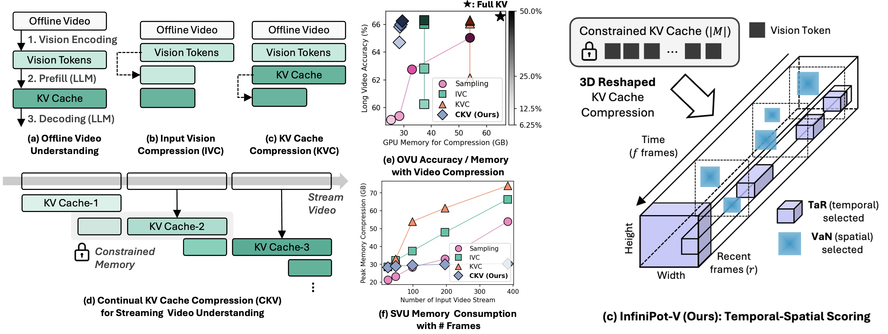

# InfiniPot-V: Memory-Constrained KV Cache Compression for Streaming Video Understanding [NeurIPS 25]

<p align="center">
  
</p>

> **Disclaimer**: This repository is a research-purpose re-implementation for reproducing the results presented in [InfiniPot-V](https://openreview.net/forum?id=hFxOZjHyTg). It does not include all components of the full methodology described in the paper.

---

## Installation

```bash
pip install -r requirements.txt
```

Tested with `torch==2.6` and CUDA 12.4 environment.

---

## Quick Start

```bash
bash scripts/run_sample.sh 0  # GPU ID
```
Supported Models: Qwen2-VL, Qwen2.5-VL series

### Example Result (Qwen2.5-VL-7B)
**Setup**: 220 seconds surveillance video (~32K context length) compressed to 4K tokens using InfiniPot-V
(Sample video from [MLVU](https://huggingface.co/datasets/MLVU/MVLU): `samples/video/6_anomaly_reco/surveil_8.mp4`)

**Question**: Is there any abnormality in this surveillance video? If so, what type of abnormality is it? 
    Respond with which option is the correct answer and explain why it is the correct answer.

**Answer**: Robbery

**InfiniPot-V-4K**: The correct answer is that there is an abnormality in the surveillance video. 
    The abnormality is the presence of two individuals entering the room and engaging in what 
    appears to be a **robbery or theft**. This is abnormal because it is not typical for people 
    to enter a room and immediately start causing damage and taking items, especially in a 
    public setting like a bank.

---

## Evaluation

```bash
# bash scripts/run_ovu.sh [GPU_ID] [MODEL_SIZE] [BLOCK_SIZE] [COMPRESS_FRAMES] [METHOD] [DATASET] [VIDEO MAX_FRAMES]
bash scripts/run_ovu.sh 0 7 32 24 infinipot-v mlvu 768
```

### Supported Long Video Understanding Benchmarks
| Benchmark | Description |
|-----------|-------------|
| `mlvu` | [MLVU](https://github.com/JUNJIE99/MLVU) - Multi-task Long Video Understanding |
| `videomme` | [Video-MME](https://video-mme.github.io/) - Video Multi-Modal Evaluation |
| `lvb` | [LongVideoBench](https://longvideobench.github.io/) |
| `egoschema` | [EgoSchema](https://egoschema.github.io/) - Egocentric Video QA |

Please download videos from each benchmark's official website and organize them according to the dataset structure. For faster evaluation, use the `--load_dumped` option to load pre-dumped pre-processed video pixel values.

---

## Key Arguments

| Argument | Description |
|----------|-------------|
| `--compression_method` | KV cache compression strategy. `uniform`, `swa`, `infinipot-v` |
| `--block_size` | Block size for continual KV cache compression (KVC). |
| `--compress_frame_num` | Number of frames to compress in the KV cache after each block. |
| `--max_frames_num` | Maximum number of frames to sample from the input video. |
| `--load_dumped` | Load pre-dumped outputs for faster evaluation. |

### Design Choices

- `block_size`: Controls the granularity of block-wise processing. Larger values process more frames at once but require more memory. (ex. block size = 32, token_per_frame = 140 => token budget is ~4K)
- `compress_frame_num`: Determines how aggressively the KV cache is compressed. Higher values lead to more compression but may affect quality.
- `compression_method`: 
  - `uniform`: Uniform frame kv cache selection
  - `swa`: [sliding window attention](https://guangxuanx.com/blog/stacking-swa.htm) (sink + recent tokens)
  - `infinipot-v`: Our proposed method (TaR + VaN method)

---

## Citation

If you find this work useful, please cite:

```bibtex
@inproceedings{
kim2025infinipotv,
title={InfiniPot-V: Memory-Constrained {KV} Cache Compression for Streaming Video Understanding},
author={Minsoo Kim and Kyuhong Shim and Jungwook Choi and Simyung Chang},
booktitle={The Thirty-ninth Annual Conference on Neural Information Processing Systems},
year={2025},
url={https://openreview.net/forum?id=hFxOZjHyTg}
}
```

---

Contributions and extensions to this repository are always welcome 🤗
